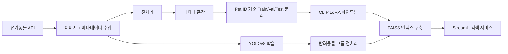

# SafeSight
텍스트 기반 멀티모달 AI 반려동물 실종 탐색 시스템


## 프로젝트 소개
- 본 프로젝트의 이름은 'SafeSight'이며, 사용자가 "갈색 털에 흰 발을 가진 강아지", "빨간 목줄을 한 고양이"처럼 자연어로 반려동물의 외형을 입력하면 해당 설명과 시각적으로 유사한 유기동물 이미지를 검색하고 추천하는 서비스이다. 일반적인 객체 탐지 모델처럼 Bounding Box를 찾는 방식이 아니라, CLIP 기반 이미지-텍스트 임베딩을 사용하여 텍스트와 이미지가 같은 벡터 공간에서 비교되도록 설계하였다. 이미지 데이터에 맞게 LoRA 방식으로 CLIP 모델을 미세조정하였으며, YOLOv8을 통해 배경 노이즈를 제거한 반려동물 크롭 이미지를 FAISS 인덱스에 저장하여 빠른 검색이 가능하도록 구현하였다. 추천 결과는 Streamlit UI에서 유사도 순으로 이미지와 함께 제공된다.

### 해결하고자 하는 문제
- 실종 반려동물을 찾으려면 각 보호소 홈페이지를 직접 돌아다니며 수백 장의 사진을 일일이 확인해야 하는 피로감이 있음.
- 기존 검색은 지역/축종 필터 중심이라 사용자가 기억하는 '특정 외형'으로 직접 검색하는 방법이 없음.
- 일반적인 CLIP 모델은 보호소 촬영 환경(철장, 콘크리트 배경)이나 한국 반려동물 종 이름(믹스견 등)에 최적화되지 않아 검색 정확도가 낮을 수 있음.

### 최종 목표
- 자연어 입력(예: "갈색 말티즈, 빨간 목줄")을 통해 외형에 부합하는 유기동물 이미지 검색.
- LoRA 파인튜닝을 통해 보호소 이미지 도메인에 맞는 텍스트-이미지 유사도 정교화.
- YOLOv8 기반 전처리로 배경 노이즈를 제거하여 반려동물 외형 중심 검색 품질 향상.
- Streamlit 웹 UI를 통해 검색 결과를 시각화하고 강아지/고양이 필터 기능 제공.
- 사용자가 "흰색 포메라니안, 귀 한쪽이 접혀 있어"처럼 자연스럽게 말해도 검색이 되도록 함.

### 실행 화면

1.메인 화면


2.검색 결과 화면


## 프로젝트 흐름
사용자 텍스트 쿼리 → CLIP Text Encoder → 벡터 변환 → FAISS Vector DB 내 이미지 벡터와 코사인 유사도 비교 → 가장 유사도가 높은 유기동물 이미지 출력  
(이미지 입력 시) 업로드 이미지 → YOLOv8 반려동물 크롭 → CLIP Image Encoder → 동일 파이프라인
<br>

## 역할 분담
- 신연주
  - 데이터 전처리 및 증강 (RandomHorizontalFlip, RandomRotation, ColorJitter)
  - CLIP 모델 LoRA 파인튜닝 
  - Streamlit 화면 구성 및 인터랙티브 UI 설계
  - 예외 처리 테스트 및 UI 안정화 + 데모 영상 촬영
  - 결과 분석 및 GitHub README 정리, 보고서 작성
- 민지영
  - 데이터 확보 및 Bounding Box 라벨링 
  - YOLOv8 기반 반려동물 탐지 모델 학습 및 크롭 파이프라인 구현
  - YOLO–CLIP 통합 및 검색 성능 개선
  - 발표자료 제작 및 발표

## 개발 환경 및 의존성

### 개발 환경
- Python 3.10
- 학습 환경: Google Colab (Tesla T4 GPU, VRAM 15.6GB)
- 대용량 데이터 및 모델 가중치는 Google Drive에 저장

### 핵심 라이브러리
- **streamlit** — 웹 UI
- **torch**, **torchvision** — CLIP 모델 실행
- **transformers**, **peft** — CLIP + LoRA 파인튜닝 모델 로드
- **ultralytics** — YOLOv8 반려동물 탐지
- **faiss-gpu** — 이미지 임베딩 유사도 검색
- **pandas**, **numpy**, **pillow** — 데이터 처리 및 이미지 가공

## 상세 설치/실행 방법

### 사전 준비
- 모델 가중치 및 FAISS 인덱스 파일은 Google Drive를 통해 제공됩니다.
- Drive 링크: https://drive.google.com/drive/folders/1BtKvOQV_7EWx5AhCrFxW-X-OoMS-yjGe?usp=share_link

### 실행 방법

1. 레포 클론
   ```bash
   git clone https://github.com/Yeondu428/SafeSight.git
   ```

2. 드라이브에서 다음 파일/폴더 다운로드: `image_index.faiss`, `index_map.csv`, `clip_lora_augmentation`, `best.pt`, `images/`

   - `image_index.faiss` → `data/embeddings/`에 위치
   - `index_map.csv` → `data/embeddings/`에 위치
   - `clip_lora_augmentation/` → `models/clip_lora_augmentation/`에 위치
   - `best.pt` → `models/`에 위치
   - `images/` → `data/raw/images/`에 위치 (검색 결과 화면 출력에 필요, 약 700MB)

4. 가상환경 생성 및 활성화
   ```bash
   python -m venv venv
   # Windows
   venv\Scripts\activate
   # Mac/Linux
   source venv/bin/activate
   ```

5. 패키지 설치
   ```bash
   pip install -r requirements.txt
   ```

6. 앱 실행
   ```bash
   streamlit run app.py
   ```

7. 웹 화면에서 자연어로 반려동물 외형을 입력한 후 **검색하기** 버튼 클릭

8. 검색 결과가 표시되면 유사도 순으로 유기동물 이미지가 출력됨. 강아지/고양이 필터 버튼으로 종류 구분 가능
<br>

##다운로드 필요 파일

앱 실행을 위해 아래 파일들을 Google Drive에서 다운로드해야 합니다.

드라이브 링크: [Google Drive 링크 추가 예정]

| 파일명 | 위치 | 용량 | 설명 |
|--------|------|------|------|
| `image_index.faiss` | `data/embeddings/` | 7.7MB | FAISS 벡터 인덱스 (이미지 임베딩 DB) |
| `index_map.csv` | `data/embeddings/` | 61.7KB | FAISS 인덱스와 Pet ID 매핑 테이블 |
| `images/` | `data/raw/` | 약 700MB | 유기동물 원본 이미지 4,000장 (검색 결과 출력에 필요) |
| `adapter_model.safetensors` | `models/clip_lora_augmentation/` | 16.5MB | 최종 LoRA 파인튜닝 가중치 |
| `best.pt` | `models/` | 6.6MB | YOLOv8 반려동물 탐지 가중치 |

## 데이터 파이프라인



## 최종 성능

| 모델 | R@1 | R@5 | R@10 | mAP |
|------|-----|-----|------|-----|
| Zero-shot CLIP (Baseline) | 9.2% | 29.7% | 38.7% | 19.5% |
| LoRA r=8 | 9.2% | 29.7% | 38.7% | 19.5% |
| LoRA r=16 | 10.8% | 29.2% | 40.7% | 20.5% |
| **LoRA r=16 + 데이터 증강 (최종)** | **12.0%** | **34.8%** | **47.0%** | **22.4%** |

Zero-shot 대비 **R@1 +2.8%p / R@10 +8.3%p** 향상


## 기술 스택

### Web & Backend


### AI / ML & Vector DB


### Data & Database


### External APIs


### Management & Collaboration


